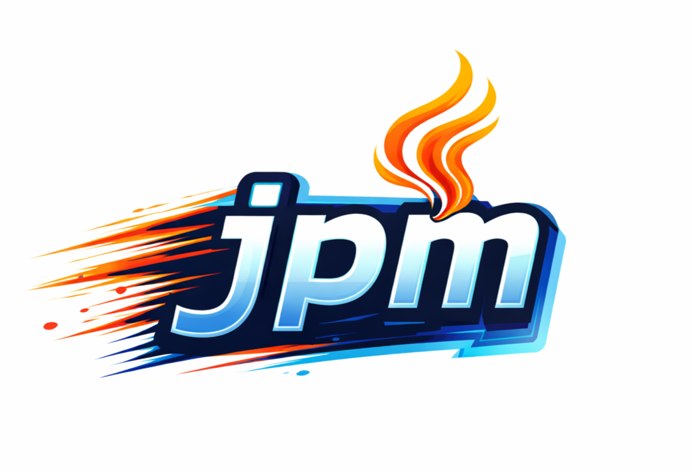

# JPM — Java Package Manager

<p align="center">
  
</p>

<p align="center">
  
  
  
  
</p>

A tiny, focused CLI to **create, manage, build, and run Java projects without an IDE**.  
Fast, repeatable, and simple — perfect for quick prototypes, CI/CD scripts, and learning Java.

**Version:** `1.0.1`  
**Release date:** `2026-02-09`

## ✨ What is JPM?

JPM is a command-line Java project manager inspired by tools like `npm` and `pip`, but built on top of **Maven** and **Spring Initializr**.

### Features

- Friendly CLI for **Standard Java** and **Spring Boot** projects
- No IDE required — everything from the terminal
- Reproducible builds using **Maven Wrapper**
- Modern defaults:
  - JUnit 5
  - Fat JAR via Maven Shade
- Simple dependency management (install/uninstall)
- Cross platform (Windows, macOS, Linux)
- Ideal for CI/CD, microservices, and beginners

## 📦 Installation

#### 1️⃣ Clone the repository

```powershell
git clone https://github.com/Mainakcris7/jpm.git
cd "jpm"
```

#### 2️⃣ Install globally

Copy `dist/jpm.exe` (or `jpm` binary) to a folder in your PATH.

For example, on Windows:
Copy `dist/jpm.exe` to `C:\Program Files\jpm\bin\jpm.exe` and add `C:\Program Files\jpm\bin\` to your system PATH.

🌟 Note: This repoistory already includes a pre-built `jpm.exe` in the `dist` folder for convenience, you can build your own version if needed, following the steps below.

#### 3️⃣ Build JPM (Optional)

1. Create a virtual environment and activate it:

```powershell
python -m venv venv
```

2. Activate the virtual environment:

- On Windows:

```powershell
venv\Scripts\activate
```

- On macOS/Linux:

```bash
source venv/bin/activate
```

3. Install dependencies

```powershell
pip install -r requirements.txt
```

4. Build the executable using PyInstaller:

- On Windows:

```powershell
pyinstaller --onefile --add-data "mvnw.cmd;." --add-data "mvnw;." --add-data ".mvn;.mvn" jpm.py
```

- On macOS/Linux:

```bash
pyinstaller --onefile --add-data "mvnw:." --add-data "mvnw.cmd:." --add-data ".mvn:.mvn" jpm.py
```

5. The executable will be located in the `dist` folder as `jpm.exe` (or `jpm` on macOS/Linux).

6. Follow step 2 to copy the built executable to a folder in your PATH.

#### 4️⃣ Verify installation

```powershell
jpm --version
```

You should see:

```powershell
📦 Java Package Manager (JPM) Version: "1.0.0" (2026-02-08)
☕ Java Runtime: java version "21.0.6" 2025-01-21 LTS
🖥️  Operating System: "Windows 11", architecture: "AMD64"
```

## ⚙️ One-Time Setup

Run the `setup` command once after installation.

```powershell
jpm setup
```

What it does:

- Verifies Java installation
- Ensures Maven Wrapper is available

## 🚀 Quick Start

```
jpm setup
jpm init
cd <artifact_id>
jpm run
```

## 🧰 Commands

All commands must be run inside a project directory (where pom.xml exists).

##### 1. `jpm init` - Create a new project interactively.

```
jpm init
```

Choose:
`> ☕ Standard Java Project`
`> 🍃 Spring Boot Project`

Output:

```
✨ Project created: demo
👉 cd demo && jpm run
```

##### 2. `jpm install <package>` - Install a dependency

```powershell
jpm install com.google.code.gson:gson:2.10.1
```

**Accepted formats:**

- `group:artifact:version` (e.g., `com.google.code.gson:gson:2.10.1`)
- `group:artifact` (e.g., `com.google.code.gson:gson` - latest version will be used)
- `artifact` search (e.g., `caffeine`)
- Spring starter aliases (e.g., `web`, `data-jpa`, `security`)

**Output:**

```
🔍 Searching Maven Central for 'com.google.code.gson:gson:2.10.1'...
✅ Added dependency to pom.xml
⌛ Downloading JARs...
```

##### 3. `jpm uninstall <artifact>` - Remove a dependency

```powershell
jpm uninstall gson
```

**Output:**

```
🗑️  Uninstalling 'gson'...
✅ Dependency removed from pom.xml
```

##### 4. `jpm run` - Compile and run the project

```powershell
jpm run
```

_Spring Boot projects use `spring-boot:run`_

**Output:**

```
🛠️  Compiling and executing your code ...
Hello, World!
```

##### 5. `jpm build` - Package the project

```powershell
jpm build
```

**Output:**

```
🏗️  Building project...
✅ Build complete.
```

##### 6. `jpm test` - Run tests

```powershell
jpm test
```

**Output:**

```
🧪 Running tests...
✅ All tests passed.
```

##### 7. `jpm clean` - Clean compiled files

```powershell
jpm clean
```

##### 8. `jpm sync` - Resolve and download dependencies

```powershell
jpm sync
```

##### 9. `jpm --version` / `jpm -v` - Show JPM and environment info

```powershell
jpm --version
```

**Output:**

```
📦 Java Package Manager (JPM) Version: "1.0.0" (2026-02-08
☕ Java Runtime: java version "21.0.6" 2025-01-21 LTS)
🖥️  Operating System: "Windows 11", architecture: "AMD64"
```

## 📝 Notes & Tips

JPM stores project metadata in:

`.jpm/jproject.json`

**Format** (For Spring Boot projects, starter dependencies are listed under `starterDependencies`):

```json
{
  "group_id": "com.example",
  "artifact_id": "demo",
  "version": "0.0.1-SNAPSHOT",
  "mainClass": "com.example.demo.DemoApplication",
  "projectType": "spring-boot",
  "starterDependencies": ["web", "data-jpa"],
  "dependencies": [
    {
      "group_id": "com.github.ben-manes.caffeine",
      "artifact_id": "caffeine",
      "version": "3.1.8"
    }
  ]
}
```

This metadata is used to manage dependencies, project configuration, determine project type, main class, and starter dependencies.

**⚠️ Do not edit it manually, if not necessary.**

## 🤝 Contributing

JPM is under active development.

- Found a bug?
- Have a feature idea?
- Want to improve docs

Pull requests and issues are welcome 🙌

## 📬 Contact

Feel free to reach out for support, feedback, or just to say hi!
Email: mainakcr72002@gmail.com
